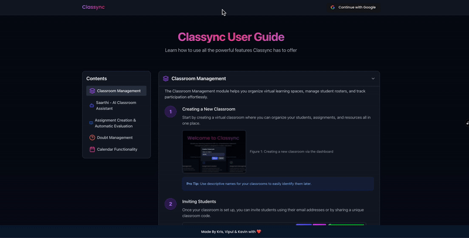

# Classync 🎓
A Seamless Platform for Collaborative Learning.
Classync is an AI-powered platform designed to enhance classroom collaboration, automate evaluations, and streamline academic workflows.

## 🚀 Features

- **Classroom Management** – Organize and manage classes efficiently.
- **Saarthi - AI Classroom Assistant** – Get AI-powered insights and assistance.
- **Assignment Creation & Automatic Evaluation** – Generate and evaluate assignments with ease.
- **Doubt Management** – Facilitate student queries and discussions.
- **Calendar Functionality**– Keep track of schedules and deadlines.

For more information, check out the **[User Guide](https://classync-demo.vercel.app/user-guide)**.  

## 💻 Tech Stack:
<table align="center">
  <tr>
    <td align="center" width="90">
      
       Spring Boot
    </td>
    <td align="center" width="90">
      
       React
    </td>
    <td align="center" width="90">
      
       Flask
    </td>
    <td align="center" width="90">
      
       PostgreSQL
    </td>
    <td align="center" width="90">
      
       Hugging Face
    </td>
    <td align="center" width="90">
      
       ChromaDB
    </td>
    <td align="center" width="90">
      
       Scikit-learn
    </td>
  </tr>
</table>

🚀 Feel free to contribute! Fork the repo and submit a pull request.

